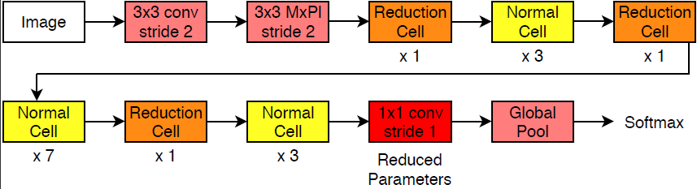

# Efficient and Compact Convolutional Neural Network Architectures for Non-temporal Real-time Fire Detection

 Tested using Python >= 3.6.x, [PyTorch >= 1.5](https://pytorch.org/), and [OpenCV 3.x / 4.x](http://www.opencv.org) (requires opencv extra modules - ximgproc module for superpixel segmentation)

## Architectures:

&nbsp;&nbsp;&nbsp;&nbsp;&nbsp;&nbsp;&nbsp;&nbsp;&nbsp;&nbsp;&nbsp;&nbsp;&nbsp;&nbsp;&nbsp;&nbsp;
&nbsp;&nbsp;&nbsp;&nbsp;&nbsp;&nbsp;&nbsp;&nbsp;&nbsp;&nbsp;&nbsp;&nbsp;&nbsp;&nbsp;&nbsp;&nbsp;
&nbsp;&nbsp;&nbsp;&nbsp;&nbsp;&nbsp;&nbsp;&nbsp;&nbsp;&nbsp;&nbsp;&nbsp;&nbsp;&nbsp;&nbsp;&nbsp;
&nbsp;&nbsp;&nbsp;&nbsp;&nbsp;&nbsp;&nbsp;&nbsp;&nbsp;&nbsp;&nbsp;&nbsp;&nbsp;&nbsp;&nbsp;&nbsp;
&nbsp;&nbsp;&nbsp;&nbsp;&nbsp;&nbsp;&nbsp;&nbsp;NasNet-A-OnFire architecture (above)


&nbsp;&nbsp;&nbsp;&nbsp;&nbsp;&nbsp;&nbsp;&nbsp;&nbsp;&nbsp;&nbsp;&nbsp;&nbsp;&nbsp;&nbsp;&nbsp;
&nbsp;&nbsp;&nbsp;&nbsp;&nbsp;&nbsp;&nbsp;&nbsp;&nbsp;&nbsp;&nbsp;&nbsp;&nbsp;&nbsp;&nbsp;&nbsp;
&nbsp;&nbsp;&nbsp;&nbsp;&nbsp;&nbsp;&nbsp;&nbsp;&nbsp;&nbsp;&nbsp;&nbsp;&nbsp;&nbsp;&nbsp;&nbsp;
&nbsp;&nbsp;&nbsp;&nbsp;&nbsp;&nbsp;&nbsp;&nbsp;&nbsp;&nbsp;&nbsp;&nbsp;&nbsp;&nbsp;&nbsp;&nbsp;
&nbsp;&nbsp;&nbsp;&nbsp;&nbsp;&nbsp;ShuffleNetV2-OnFire architecture (above)

## Abstract:

_"—Automatic visual fire detection is used to complement traditional fire detection sensor systems (smoke/heat). In this work, we investigate different Convolutional Neural Network (CNN) architectures and their variants for the nontemporal real-time bounds detection of fire pixel regions in video (or still) imagery. Two reduced complexity compact CNN architectures (NasNet-A-OnFire and ShuffleNetV2-OnFire) are proposed through experimental analysis to optimise the computational efficiency for this task. The results improve upon the current state-of-the-art solution for fire detection, achieving an accuracy of 95% for full-frame binary classification and 97% for superpixel localisation. We notably achieve a classification speed up by a factor of 2.3× for binary classification and 1.3× for superpixel localisation, with runtime of 40 fps and 18 fps respectively, outperforming prior work in the field presenting an efficient, robust and real-time solution for fire region detection. Subsequent implementation on low-powered devices (Nvidia Xavier-NX, achieving 49 fps for full-frame classification via ShuffleNetV2-OnFire) demonstrates our architectures are suitable for various real-world deployment applications."_

[[Thomson, Bhowmik, Breckon, In Proc. International Conference on Machine Learning Applications, IEEE, 2020](https://breckon.org/toby/publications/papers/thompson20fire.pdf)]

---

## Fire Detection Datasets:

The custom dataset used for training and evaluation can be found on [[Durham Collections - Dunnings/Breckon, 2018](https://collections.durham.ac.uk/collections/r1ww72bb497)] and [[Durham Collections - Samarth/Breckon, 2019](https://collections.durham.ac.uk/collections/r2jm214p16f)] (together with the trained network models). A direct download link for the dataset is [[Dunnings, 2018 - original data](https://collections.durham.ac.uk/downloads/r2d217qp536)] and [[Samarth, 2019 - additional data](https://collections.durham.ac.uk/downloads/r10r967374q)].

In addition, standard datasets such as [furg-fire-dataset](https://github.com/steffensbola/furg-fire-dataset) were also used for training and evaluation (and are included as a subset within the above datasets for [[Dunnings, 2018 - original data](https://collections.durham.ac.uk/downloads/r2d217qp536)]).

* DOI for datsets - [http://doi.org/10.15128/r2d217qp536](http://doi.org/10.15128/r2d217qp536) and [http://doi.org/10.15128/r10r967374q](http://doi.org/10.15128/r10r967374q).

A download script ```download-dataset.sh``` is also provided which will create an additional ```dataset``` directory containing the training dataset (10.5Gb in size, works on Linux/MacOS).


Original frame (left), Frame after superpixel segmentation (middle), Frame after superpixel fire prediction (right)

---

## Instructions to test pre-trained models:

To download and test the supplied code and pre-trained models (with **TensorFlow 1.x / TFLearn 0.3.2 / OpenCV 4.x** installed) do:

```
$ git clone https://github.com/tobybreckon/fire-detection-cnn.git
$ cd fire-detection-cnn
$ sh ./download-models.sh
$ python firenet.py models/test.mp4
$ python inceptionVxOnFire.py -m 1 models/test.mp4
$ python superpixel-inceptionVxOnFire.py -m 1 models/test.mp4
```

where ```-m x``` specifies the use of either of the _InceptionV1OnFire, InceptionV3OnFire, InceptionV4OnFire_
models for ```x``` in ```[1,3,4]```. By default it uses _InceptionV1OnFire_ if ```-m``` is not specified.


If by default you have **TensorFlow 2.x** installed on your system, then a workflow to make this repo work on your system is via a Tensorflow 1.x virtual environment (as TFLearn is not supported in TensorFlow 2.0 - this [issue](https://github.com/tflearn/tflearn/issues/1121)) is as follows:

```
$ virtualenv -p python3 ~/venv/tf-1.1.5-gpu
$ source ~/venv/tf-1.1.5-gpu/bin/activate
$ pip install tensorflow-gpu==1.15
$ pip install tflearn
$ pip install opencv-contrib-python
....
$ python3 firenet.py models/test.mp4
```

---

## Instructions to use pre-trained models with other frameworks:

To convert the supplied pre-trained models from TFLearn checkpoint format to protocol buffer (.pb) format (used by [OpenCV](http://www.opencv.org) DNN, [TensorFlow](https://www.tensorflow.org/), ...) and also tflite (used with [TensorFlow](https://www.tensorflow.org/)) do:


```
$ cd converter
$ python firenet-conversion.py
$ python inceptionVxOnFire-conversion.py -m 1
```

This creates a set of six ```.pb``` and ```.tflite``` files inside the ```converter``` directory (```firenet.xxx``` / ```inceptionv1onfire.xxx```/```sp-inceptionv1onfire.xxx``` for ```xxx``` in ```[pb, tflite]```). The ```inceptionVxOnFire-conversion.py``` can be similarly run with ```-m 3``` and ```-m 4``` to generate the same conversions for the _InceptionV3OnFire_ and _InceptionV4OnFire_ models respectively.

These alternative format files can then be validated  with the [OpenCV](http://www.opencv.org) DNN module (OpenCV > 4.1.0-pre) and [TensorFlow](https://www.tensorflow.org/) against the original (tflearn) version from within the same directory, in order to check that they all produce the same output (up to 3 decimal places) as follows:

```
$ python firenet-validation.py
Load tflearn model from: ../models/FireNet ...OK
Load protocolbuf (pb) model from: firenet.pb ...OK
Load tflite model from: firenet.tflite ...OK
Load test video from ../models/test.mp4 ...
frame: 0        : TFLearn (original): [[9.999914e-01 8.576833e-06]]     : Tensorflow .pb (via opencv): [[9.999914e-01 8.576866e-06]]    : TFLite (via tensorflow): [[9.999914e-01 8.576899e-06]]: all equal test - PASS
frame: 1        : TFLearn (original): [[9.999924e-01 7.609045e-06]]     : Tensorflow .pb (via opencv): [[9.999924e-01 7.608987e-06]]    : TFLite (via tensorflow): [[9.999924e-01 7.608980e-06]]: all equal test - PASS
frame: 2        : TFLearn (original): [[9.999967e-01 3.373572e-06]]     : Tensorflow .pb (via opencv): [[9.999967e-01 3.373559e-06]]    : TFLite (via tensorflow): [[9.999967e-01 3.373456e-06]]: all equal test - PASS
frame: 3        : TFLearn (original): [[9.999968e-01 3.165212e-06]]     : Tensorflow .pb (via opencv): [[9.999968e-01 3.165221e-06]]    : TFLite (via tensorflow): [[9.999968e-01 3.165176e-06]]: all equal test - PASS
...
```

This can be similarly repeated with the ```inceptionVxOnFire-validation.py``` scripts with the options ```-m x``` for ```x``` in ```[1,3,4]``` for each of the InceptionVxOnFire models and similarly with the additional option ```-sp``` for each of the superpixel InceptionVxOnFire models (e.g. ```inceptionVxOnFire-validation.py -m 3 -sp``` validates the _InceptionV3OnFire_ superpixel model and so on). N.B. here the superpixel inceptionVxOnFire models are being validated against the whole image frame rather than superpixels just for simply showing consistent output between the original and converted models. Some ```FAIL```cases will be reported against this strict 3 decimal place criteria, but inspection often reveals a mildly larger ~0.1 difference (with the exception of the _...V3-OnFire_ and _...V4-OnFire_ caveat discussed above).

**To convert to to other frameworks** (such as PyTorch, MXNet, Keras, ...) from these tensorflow formats: - please see the extensive deep neural network model conversion tools offered by the [MMdnn](https://github.com/Microsoft/MMdnn) project.

---

## Example video:
[](https://www.youtube.com/embed/t6r2TndNSVY)
Video Example - click image above to play.

---

## References:

If you are making use of this work in any way (including our pre-trained models or datasets), _you must please_ reference the following articles in any report, publication, presentation, software release
or any other associated materials:

[Efficient and Compact Convolutional Neural Network Architectures for Non-temporal Real-time Fire Detection](https://breckon.org/toby/publications/papers/thompson20fire.pdf)
(Thomson, Bhowmik, Breckon), In Proc. International Conference on Machine Learning Applications, IEEE, 2020.
```
@InProceedings{samarth19fire,
  author =    {Thomson, W. and Bhowmik, N. and Breckon, T.P.},
  title =     {Efficient and Compact Convolutional Neural Network Architectures for Non-temporal Real-time Fire Detection},
  booktitle = {Proc. International Conference on Machine Learning Applications},
  year =      {2020},
  month =     {December},
  publisher = {IEEE},
  url = {http://breckon.org/toby/publications/papers/thompson20fire.pdf},
  arxiv = {http://arxiv.org/abs/2010.08833},
  note = {to appear},
  category = {imageclass},
}
```

In addition the (very permissive) terms of the [LICENSE](LICENSE) must be adhered to.

---